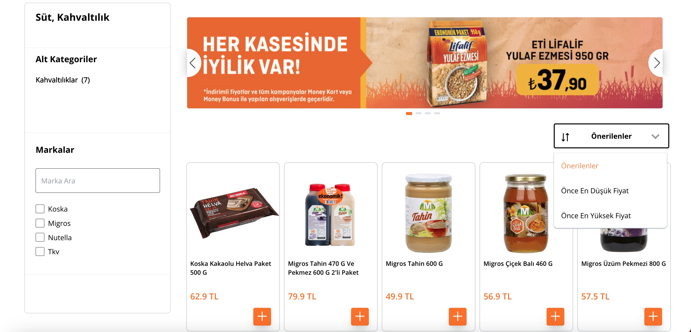
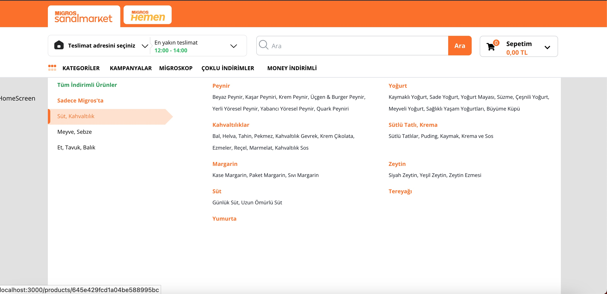
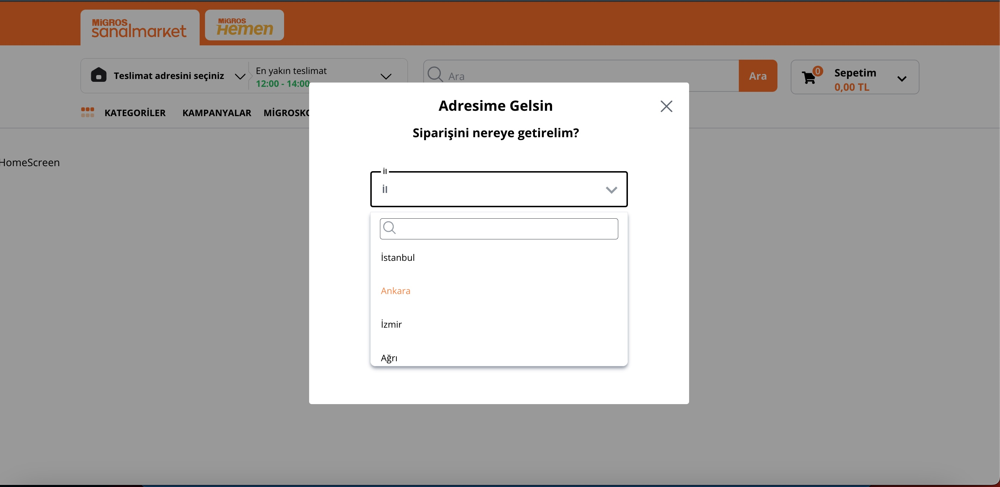
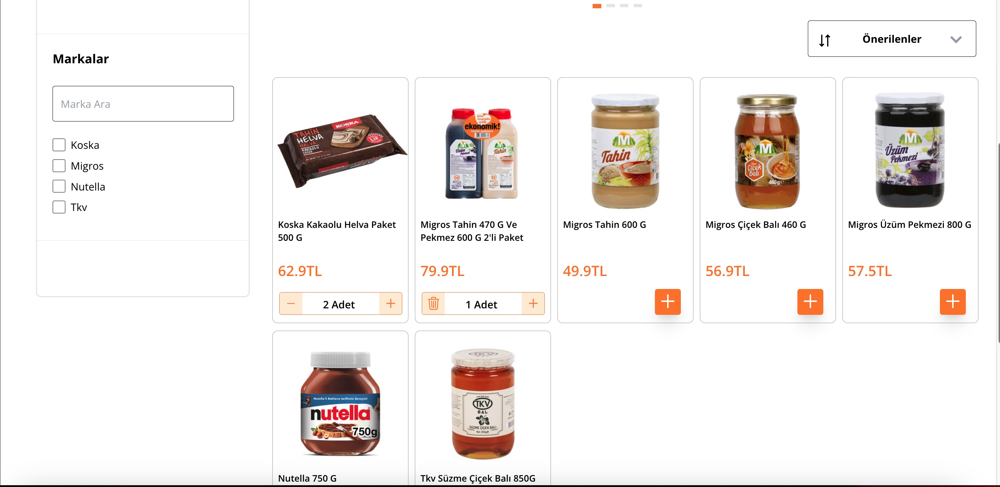
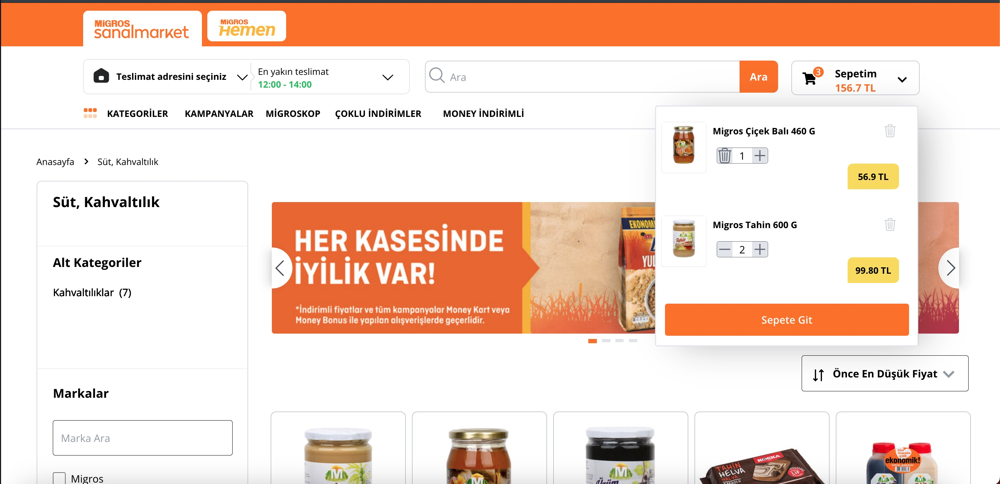
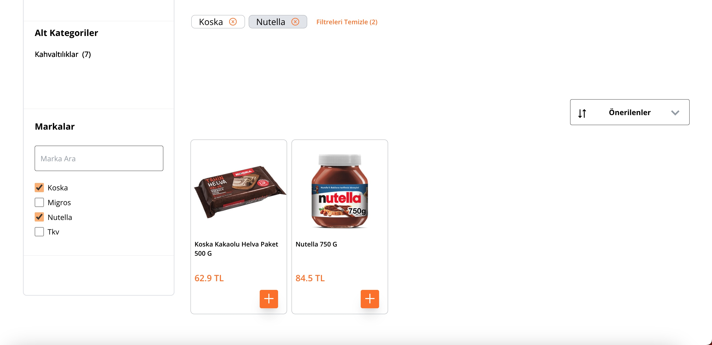

With this project, I was aiming to clone the most famous supermarket website in Turkey with using TypeScript, React, Redux, TailwindCss, Node.js , MongoDB.

In this project, there are two main files named server and client. The server file was created to use Mongo DB Express.js and Node.js.

On the other hand , the client file has been created to use React, Redux TailwindCss and TypeScript processes, which will create the design and functionality of the site.

### 2- User Role

Choosing an address, browsing the products on the site via filtering brands, sorting products and adding them to the shopping cart.

## :computer: Project Setup

1. Git clone / download the project
2. npm install
3. new terminal+ cd server -- npm start
4. new terminal+ cd client -- npm start

<h2> 🛠 &nbsp;Technologies</h2>

<table style="float:right;">
  <tr>
    <td></td>
    <td></td>
    <td></td>
  </tr>
  <tr>
    <td></td>
    <td></td>
    <td></td>
  </tr>
  <tr>
    <td></td>
    <td> </td>
    <td></td>
  </tr>
  <tr>
    <td></td>
 		<td></td>
    <td></td>
  </tr>
</table>

## :phone: To Contact

 

   
<b> <samp>To Contact </samp></b>

    
   <samp>
   <b><h2 style="color: #fc6203">Onur &nbsp; Hakan &nbsp; PESENER</h2></b>
   
      
     Project Link: <a href="https://github.com/pesener/migros-clone">Migros Clone</a>
      
      
     LinkedIn: <a href="https://www.linkedin.com/in/hakan-p-2713b576/"> LinkedIn Account</a>
      
     Instagram: <a href="https://www.instagram.com/hakanpesener/"> Instagram Account</a>
      
      
     Mail Adress: <a href="#"> hakanpesener@gmail.com</a>
   </samp>
 

