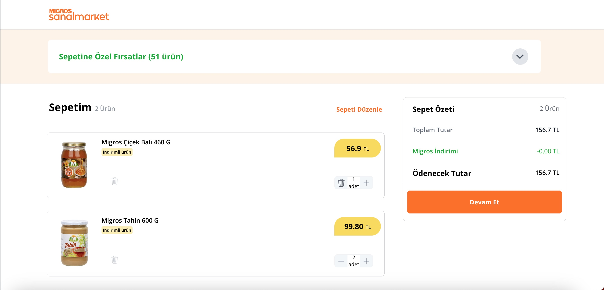

With this project, I was aiming to clone the most famous supermarket website in Turkey with using TypeScript, React, Redux, TailwindCss, Node.js , MongoDB.

### 2- User Role

Choosing an address, browsing the products on the site via filtering brands, sorting products and adding them to the shopping cart.

